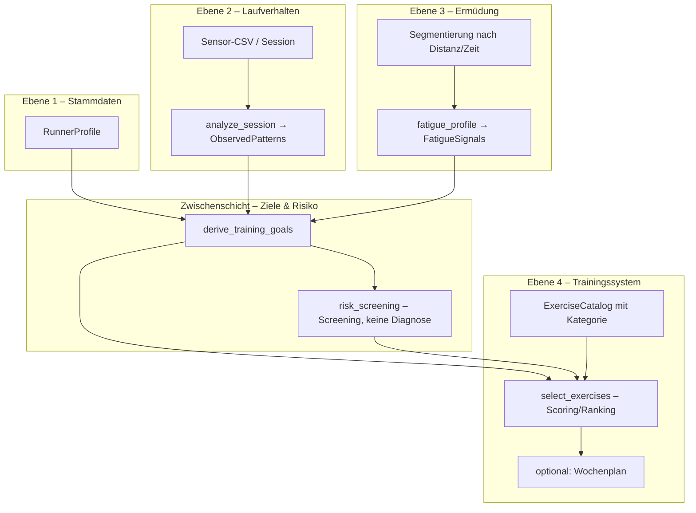

# Produktvision: Vom Muster-Screening zum persönlichen Laufcoach

> Stand: Juni 2026 · Ergänzung zu [`training-empfehlungen-struktur.md`](training-empfehlungen-struktur.md)  
> Ausgangspunkt: Produkt-Feedback – vier Ebenen der Personalisierung statt `diagnosis_id → feste Übungen`.

---

## Nordstern

**Heute (MVP):**

> Welche Übung passt zu diesem Muster?

**Ziel:**

> Welche Person läuft da, was sind ihre Ziele, Schwächen und Risiken – und was braucht sie **jetzt** als Nächstes?

Die aktuelle Architektur (regelbasierte `Diagnosis` + `_EXERCISE_MAP`) bleibt als **Ebene-2-Baustein** wertvoll. Sie wird nicht weggeworfen, sondern in eine größere Pipeline eingehängt.

---

## Ziel-Pipeline (Entkopplung)



**Kernprinzip:** `ObservedPattern` (z. B. Fersenbelastung) ist **nicht** gleichbedeutend mit einer festen Übungsliste. Dieselbe Beobachtung führt bei unterschiedlichen Profilen zu unterschiedlichen Zielen und damit zu unterschiedlichen Übungen.

### Beispiel: gleiches Muster, andere Person

| | Person A | Person B |
|---|----------|----------|
| Muster | `heel_strike_tendency` | `heel_strike_tendency` |
| Profil | 65 J., Sturzrisiko, selten gelaufen | Marathonläufer, 80 km/Woche |
| Ziele | Stabilität, sicherer Kontakt, niedrige Intensität | Kadenz/Effizienz, Belastungssteuerung im Wettkampfblock |
| Technik | Barfuß-Marsch, Einbeinstand | Metronom, Lauf-ABC, kurze Anfersen |
| Kraft | Hüfte/Knöchel vorsichtig | Waden/FT, höheres Volumen erlaubt |

---

## Die vier Ebenen

### Ebene 1: Stammdaten (`RunnerProfile`)

Selten ändernde Angaben – manuell oder importiert (später Account/Cloud).

| Feld | Typ / Beispiel | Nutzen für Empfehlung |
|------|----------------|------------------------|
| `display_name` | „Sia“ | UI |
| `age_years` | 27 | Intensität, Sturzrisiko-Heuristik |
| `sex` | optional | nur wenn evidenzbasierte Regeln existieren |
| `height_cm`, `weight_kg` | 192, 89 | BMI-Hinweis, Druckkalibrierung |
| `shoe_size` | EU 44 | später Produkt/Passform |
| `training_level` | enum: beginner … competitive | Volumen/Oberfläche der Übungen |
| `running_years` | 3 | Erfahrungs-Gewichtung |
| `weekly_sessions` | 3 | Kontext |
| `weekly_km` | 35 | Belastungskontext |
| `injury_history` | Liste + Seite + „ehemalig/aktiv“ | Risiko, Tabu-Übungen |
| `current_pain` | Ort, Skala 0–10, seit wann | **Hard filter** – keine belastenden Übungen |
| `goals` | z. B. „10 km unter 50 min“, „schmerzfrei“ | Priorisierung der Ziele |

**Beispielprofil (Sia):**

```yaml
display_name: Sia
age_years: 27
weight_kg: 89
height_cm: 192
training_level: recreational
weekly_sessions: 3
weekly_km: 35
injury_history:
  - site: knee
    side: right
    status: former
current_pain: []
goals:
  - stay_injury_free
  - improve_running_economy
```

**Codebase heute:** ❌ nicht vorhanden (nur Streamlit-Session pro Upload, kein persistiertes Nutzerprofil).

---

### Ebene 2: Laufverhalten (`ObservedPattern`)

Was MyProSole **aus Sensordaten** ableitet – nah an `core/domain/recommendations.py` + Druck-/Ganganalyse.

| Muster (Ziel-ID) | Heute in MVP? | Quelle |
|------------------|---------------|--------|
| Fersen-/Mittel-/Vorfuß-Tendenz | teilweise (`heel_strike_tendency`, FSR-Vergleich) | Druck + `hs` FSR1/FSR2 |
| Links/Rechts-Asymmetrie | ✅ `asymmetric_load_distribution` | `pressure_analysis` |
| Pronation/Supination | ⚠️ nur neutral in `gait_analysis`, nicht in Empfehlungen | `myprosole_analysis` / Gangmodul |
| Hohe Vorfuß-/Fersenbelastung | ✅ (Fersen % pro Fuß) | `per_foot_summary` |
| Niedrige Kadenz | ✅ `low_cadence` | `summary` |
| Hohe Schrittvariabilität | ✅ `high_step_variability` | `summary` |
| Lange Bodenkontaktzeit / Stance | ✅ `long_stance_phase` | `stance_ratio_mean` |

**Refactoring-Ziel:** `Diagnosis` → `ObservedPattern` umbenennen/erweitern:

- `id`, `title`, `finding`, `metrics` (wie heute)
- neu: `severity` (0–1), `confidence`, `foot` / `side`, `evidence_source`

**Codebase heute:** ✅ MVP-Regeln; ❌ kein Severity/Confidence; ❌ Ganganalyse nicht in Empfehlungs-Pipeline.

---

### Ebene 3: Ermüdungsprofil (`FatigueProfile`)

Fragestellung:

> Wie verändert sich das Laufen nach 3 km, 5 km oder 10 km?

#### Konzept

1. Session in **Segmente** teilen (Distanz-Schätzung aus Schritten + Schrittlänge, oder Zeitfenster, oder manuelle Marker).
2. Pro Segment dieselben Metriken wie Ebene 2 berechnen.
3. **Delta** zur Baseline (erste 20 % der Session) oder zum Vorsegment.

| Signal (Beispiel) | Erkennung | Mögliche Empfehlungs-Richtung |
|-------------------|-----------|-------------------------------|
| Kadenz ↓ ab km 7 | Segment-Vergleich | Kadenz-Erhalt, Core, Technik unter Ermüdung |
| Rechtsanteil ↑ | `left_right_distribution` pro Segment | Hüftstabilität, einseitige Kraft |
| Ferse ↑ | `heel_percentage` Trend | Kontaktqualität, Waden/Achilles-Monitoring |
| Schrittlänge ↓ (proxy) | Stance/step time | Überstriding unter Ermüdung |
| Variabilität ↑ | CV pro Segment | Rhythmus, Erholung |

**UI-Beispiel:**

```text
Ermüdung ab ~km 7
  • Kadenz −4 SPM vs. km 0–3
  • Belastung rechts +6 % vs. Baseline

Empfehlung (Ebene 4):
  • Gluteus-Medius-Kräftigung (Kraft)
  • Hüftstabilität / Einbeinstand (Kraft)
  • Kadenz-Erhalt im müden Zustand (Technik)
```

**Codebase heute:** ❌ keine Segmentierung nach Laufdistanz; `foot_pressure_replay` hat Frames über Zeit, aber keine Ermüdungs-Aggregation.

**Technische Voraussetzungen:**

- Ausreichend lange Aufnahme (GPS optional später; sonst Schritte × geschätzte Schrittlänge)
- Stabile Schritt-Erkennung über gesamte Session
- `core/domain/fatigue_analysis.py` (neu) – rein funktional, testbar

---

### Ebene 4: Trainingssystem

Übungen in **drei Kategorien** (nicht nur eine flache Liste):

| Kategorie | Zweck | Beispiele |
|-----------|--------|-----------|
| `technique` | Laufstil, Kontakt, Kadenz | Lauf-ABC, Skippings, Anfersen, Metronom |
| `mobility` | Beweglichkeit | Sprunggelenk, Hüfte, Wade, Großzehe |
| `strength` | Belastbarkeit, Stabilität | Wadenheben, Einbeinstand, Step-Ups, Glute Bridge, Side Plank |

Jede Übung im Katalog erhält Metadaten:

```python
@dataclass(frozen=True)
class Exercise:
    id: str
    title: str
    category: Literal["technique", "mobility", "strength"]
    targets: tuple[str, ...]      # z.B. "ankle", "hip", "cadence"
    addresses_patterns: tuple[str, ...]  # welche ObservedPattern-IDs
    contraindications: tuple[str, ...]   # z.B. "acute_knee_pain"
    intensity: Literal["low", "medium", "high"]
    min_training_level: ...
```

**Auswahl-Algorithmus (regelbasiert, vor ML):**

```text
score(exercise) =
    w_pattern  * pattern_match(exercise, observed_patterns)
  + w_goal     * goal_match(exercise, training_goals)
  + w_fatigue  * fatigue_match(exercise, fatigue_signals)
  + w_risk     * risk_penalty(exercise, risk_flags, profile)
  - w_level    * level_mismatch(exercise, profile.training_level)
```

Top-N pro Kategorie → **Trainingsplan** (z. B. 2 Technik + 2 Mobility + 2 Kraft pro Woche).

**Codebase heute:** ✅ `Exercise` in `exercises_catalog.py` – ❌ ohne `category`, `targets`, `contraindications`; ❌ festes 1:1-Mapping `_DIAGNOSIS_EXERCISE_IDS`.

---

## Ziel-Ausgabe: Läuferprofil (UI-Skizze)

### Basis (Ebene 1)

- 42 Jahre · 82 kg · 15 km/Woche

### Laufanalyse (Ebene 2)

- leichter Fersenläufer
- 61 % Belastung rechts
- Kadenz 153 SPM
- erhöhte Vorfußbelastung links

### Ermüdung (Ebene 3)

- ab km 5: Kadenz sinkt, rechte Belastung steigt

### Risiko (Screening)

- Achillessehne: mittel · Knie: niedrig · Hüfte: erhöht  
- *(Sprache: Hinweis/Screening, keine medizinische Diagnose – vgl. `docs/biomechanics/`)*

### Trainingsplan (Ebene 4)

| Technik | Mobilität | Kraft |
|---------|-----------|-------|
| Lauf-ABC | Sprunggelenk | Wadenheben |
| Kadenztraining | Hüftmobilisation | Step-Ups, einbeinige Kniebeuge |

---

## Mapping: Vision ↔ aktueller Code

| Vision | Heute | Nächster technischer Schritt |
|--------|-------|------------------------------|
| Stammdaten | — | `RunnerProfile` Dataclass + Modul `modules/runner_profile/` + `ctx`/`session` persist |
| Laufverhalten | `diagnose()` | `ObservedPattern` + Severity; Ganganalyse anbinden |
| Ermüdung | — | Segment-Metriken in `core/domain/fatigue_analysis.py` |
| Ziele & Risiko | — | `derive_training_goals(profile, patterns, fatigue)` |
| Übungsauswahl | `_EXERCISE_MAP` | Katalog-Tags + `select_exercises()` Scorer |
| Verlauf | — | `SessionRecord` (Datum, patterns, Plan-Version) lokal/DB |
| Trainingsplan | — | `TrainingPlan` Woche 1–3 aus Top-N |

---

## Phasen-Roadmap (empfohlen)

### Phase A – Entkopplung ohne neues UI

1. `ObservedPattern` = Alias/Evolution von `Diagnosis`.
2. `select_exercises(patterns, profile=None)` – wenn `profile is None`, Verhalten wie MVP.
3. Katalog: `category` + `targets` für bestehende Übungen pflegen.
4. Tests: gleiche CSV → gleiche Patterns; Profil-Mock ändert nur Auswahl.

### Phase B – Stammdaten minimal

1. Sidebar oder eigene Seite „Mein Profil“ (Streamlit).
2. `ctx.set_param("runner_profile", …)` + Session-Persistenz.
3. Hard filters: `current_pain` → Übungen mit `contraindications` ausschließen.

### Phase C – Ermüdung (Differentiator)

1. Segmente: Zeitfenster (einfach) → später Distanz-Schätzung.
2. `FatigueProfile` + UI-Block unter Laufanalyse.
3. Ziele: `maintain_cadence_under_fatigue`, `hip_stability_late_run`.

### Phase D – Coach-Erlebnis

1. Risiko-Screening-Regeln (Achilles/Knie/Hüfte) aus Profil + Mustern + Ermüdung.
2. Wochenplan, Verlauf über Uploads.
3. Optional: LLM **nur** für Texte (`finding`, Plan-Begründung), JSON-Input aus Regel-Engine.

---

## Zieldatenmodell (Domain, skizze)

```python
@dataclass(frozen=True)
class RunnerProfile: ...

@dataclass(frozen=True)
class ObservedPattern:
    id: str
    severity: float  # 0..1
    metrics: dict
    finding: str

@dataclass(frozen=True)
class FatigueSignal:
    id: str  # e.g. "cadence_drop_late"
    onset_km_estimate: float | None
    delta: dict

@dataclass(frozen=True)
class TrainingGoal:
    id: str
    priority: int

@dataclass(frozen=True)
class RiskHint:
    area: str  # achilles, knee, hip
    level: Literal["low", "medium", "elevated"]
    rationale: str

@dataclass(frozen=True)
class TrainingPlan:
    technique: tuple[str, ...]   # exercise ids
    mobility: tuple[str, ...]
    strength: tuple[str, ...]
    week_notes: str
```

Pipeline:

```python
def build_coach_report(
    profile: RunnerProfile,
    session_analysis: dict,
    *,
    prior_sessions: list[SessionRecord] | None = None,
) -> CoachReport:
    patterns = observe_patterns(session_analysis)
    fatigue = analyze_fatigue(session_analysis) if long_enough else None
    goals = derive_training_goals(profile, patterns, fatigue, prior_sessions)
    risks = screen_risks(profile, patterns, fatigue)
    plan = select_training_plan(profile, goals, patterns, fatigue, risks)
    return CoachReport(profile_summary=..., patterns=patterns, ...)
```

---

## Abgrenzung & Qualität

- **Keine medizinische Diagnose** – Risiko = Screening-Hinweis; Formulierung aus Biomechanik-KB.
- **Datenschutz:** Profil und Verlauf nur mit klarer Einwilligung speichern; keine Gesundheitsdaten in Logs.
- **Erklärbarkeit:** Jede Empfehlung: „Weil [Pattern] + [Profil] + [Ziel]“ – wichtig für Vertrauen und Bot-Review.

---

## Bot-Brainstorming: Prompts

```text
1. Entwirf das RunnerProfile-Schema (Felder, Enums, Validierung) für Streamlit MVP ohne Cloud-DB.

2. Wie segmentieren wir eine 45-min-FSR-CSV in km-ähnliche Blöcke nur aus Schritt-Events und geschätzter Schrittlänge?

3. Regel-Matrix: training_goals × exercise.categories – 10 Beispielregeln für Fersenläufer × (Anfänger vs. Marathon).

4. Welche contraindications brauchen wir für Knie/Achilles/Hüfte bei den 15 Übungen im aktuellen Katalog?

5. Migrationsplan: _EXERCISE_MAP abschaffen ohne UI-Regression – Schrittfolge in 3 PRs.
```

---

## Verwandte Dokumente

- [`training-empfehlungen-struktur.md`](training-empfehlungen-struktur.md) – Ist-Architektur MVP
- [`docs/biomechanics/README.md`](biomechanics/README.md) – Sprache, Grenzen, Screening
- [`MODULE.md`](../MODULE.md) – Modul-Plugin-System für neue Features (`runner_profile`, `coach_report`)
